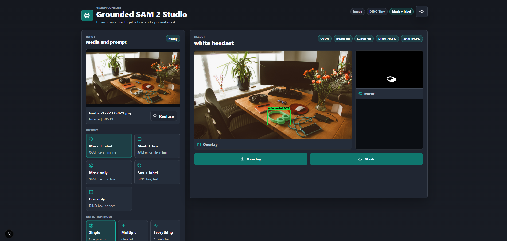
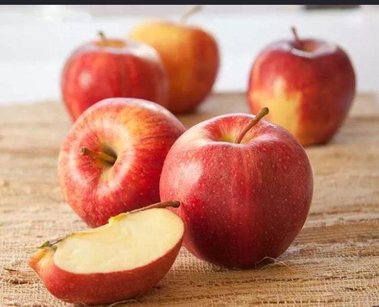
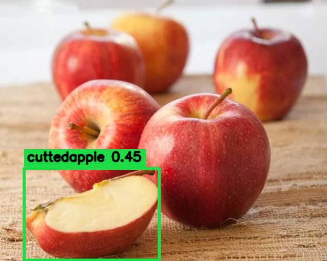
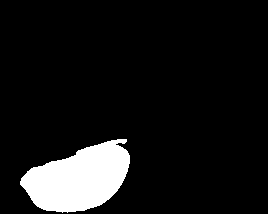
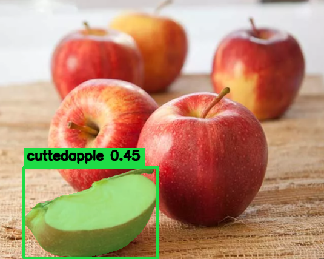

# 🚀 AutoAnnotate

### AI-Powered Automatic Image/Video Annotation using GroundingDINO + SAM2 + SAHI

> **Detect → Segment → Annotate** in just a few clicks.

AutoAnnotate is an AI-powered web application that simplifies image annotation by combining **GroundingDINO**, **Segment Anything Model 2 (SAM2)**, and **SAHI** into a single, user-friendly interface.

Instead of manually drawing masks or bounding boxes, simply upload an image, provide your object prompt, and let the models automatically generate high-quality annotations.

---

# 🎬 Demo

<video src="docs/demo.mp4" controls width="900"></video>

### Web Interface



---

# ✨ Features

* 🎯 Open-Vocabulary Object Detection using **GroundingDINO**
* ✂️ High-quality Segmentation with **SAM2**
* 🖼️ Large Image Support via **SAHI**
* 🌐 Easy-to-use Web Interface
* ⚡ GPU Acceleration (CUDA supported)
* 📦 Automatic Annotation Generation
* 🔄 Fast End-to-End Processing

---

# 🧠 How It Works

```text
                 Upload Image
                      │
                      ▼
            GroundingDINO Detection
                      │
               Bounding Boxes
                      ▼
          SAHI Image Slicing (Optional)
                      │
                      ▼
              SAM2 Segmentation
                      │
              Segmentation Masks
                      ▼
            Automatic Annotations
```

---

# 📸 Results

## Original Image (prompt: cuttedapple)
Note: Specifying object without spaces can improve accuracy



---

## GroundingDINO Detection



---

## SAM2 Segmentation



---

## Final Annotation



---

# 🛠️ Tech Stack

| Component     | Purpose             |
| ------------- | ------------------- |
| Python        | Backend             |
| Next.js       | Frontend            |
| PyTorch       | Deep Learning       |
| GroundingDINO | Object Detection    |
| SAM2          | Segmentation        |
| SAHI          | Large Image Slicing |
| OpenCV        | Image Processing    |

---

# 📂 Project Structure

```text
AutoAnnotate/
│
├── app/                    # Next.js frontend
├── backend/                # Python backend
├── public/
│   └── results/
├── webapp-data/
├── docs/
│   ├── demo.gif
│   ├── ui-home.png
│   ├── input.jpg
│   ├── detection.jpg
│   ├── segmentation.jpg
│   └── final-result.jpg
├── requirements.txt
├── package.json
└── README.md
```

---

# ⚙️ Requirements

* Python 3.10+
* Node.js 18+
* CUDA-compatible GPU (recommended)

---

# 🚀 Installation

## 1. Clone the repository

```bash
git clone https://github.com/DiedrickD/AutoAnnotate-SAM2-SAHI-GroundingDINO.git

cd AutoAnnotate-SAM2-SAHI-GroundingDINO
```

---

## 2. Create a virtual environment

### Windows

```powershell
python -m venv .venv

.\.venv\Scripts\Activate.ps1
```

---

## 3. Install Python dependencies

```powershell
python -m pip install -r requirements.txt
```

---

## 4. Install Node.js dependencies

```powershell
npm install
```

---

# ▶️ Running the Application

Start the web application:

```powershell
.\start-webapp.cmd
```

The application will be available at:

```text
http://127.0.0.1:3000
```

---

# 🖱️ Usage

1. Launch the application.
2. Upload an image.
3. Enter the object prompt.
4. Click **Process**.
5. Wait for the models to finish inference.
6. View and download the generated results.

---

# 📁 Output

Generated outputs are saved inside:

```text
public/results/
```

Depending on the selected options, the application may generate:

* Detected bounding boxes
* Segmentation masks
* Annotated images
* Processed visualization outputs

---

# 📌 Notes

The first launch may take some time because the application downloads and caches large AI models such as:

* GroundingDINO
* SAM2
* YOLO (if enabled)

These models are only downloaded once.

The folders `public/results/` and `webapp-data/` are excluded from Git tracking because they may contain large generated files.

---

# 🚧 Roadmap

* [ ] Batch image processing
* [ ] Video annotation
* [ ] COCO export
* [ ] YOLO export
* [ ] Label Studio integration
* [ ] Automatic dataset generation
* [ ] Docker support

---

# 🤝 Contributing

Contributions are always welcome!

If you find a bug, have a feature request, or want to improve the project, feel free to open an Issue or submit a Pull Request.

---

# 🙏 Acknowledgements

This project is built upon the amazing work of:

* GroundingDINO
* Segment Anything Model 2 (SAM2)
* SAHI
* PyTorch
* Next.js

Huge thanks to the open-source community for making these tools available.

---

# ⭐ Support the Project

If you find this project useful for your research or work, please consider giving it a ⭐ on GitHub.

It helps others discover the project and motivates future development.
